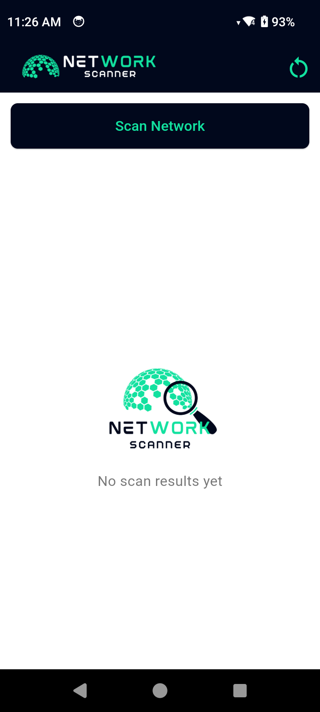
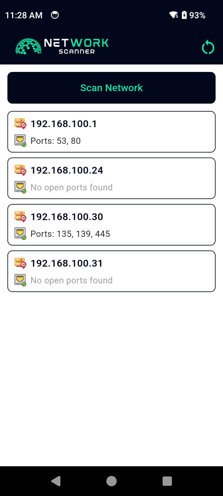

# 📡 Flutter LAN Scanner App

A Flutter application that scans devices on the local network (LAN), checks for open ports (including port `4370`), and displays the results in a user-friendly interface.

---

## ✨ Features

- 🔍 **Quick ICMP Scan** to discover devices on the same Wi-Fi subnet.
- 🔐 **Port Scanning** on discovered devices (supports common ports like 21, 80, 443, and 4370).
- 🖥️ Modern UI with real-time scanning feedback.
- 🎨 Dynamic list of scanned devices showing IP and open ports.
- 🧭 Auto-detects subnet based on your current Wi-Fi IP.
- 📱 Built with Flutter and Dart.

---

## App Screenshots

<table>
  <tr>
    <td></td>
    <td></td>
    <td></td>
  </tr>
</table>